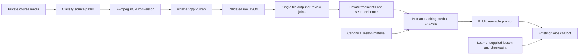

# Architecture

The public prompt is the product. The Python package preserves and explains the
supporting transcription workflow that made the teaching-method analysis possible.
There is no runtime connection between the package and a chatbot conversation.

## Module boundaries

| Module | Responsibility |
|---|---|
| `config` | TOML parsing, validated settings, input/output/work isolation |
| `classify` | Unicode-normalized course path routing |
| `media` | FFmpeg, FFprobe and whisper.cpp invocation and diagnostics |
| `transcripts` | Strict JSON shape/timestamp checks; JSON/TXT/SRT/VTT rendering |
| `merge` | Window starts, silence-aware seam choice and timestamp ownership |
| `state` | Atomic writes, fingerprints, file hashes and process locks |
| `pipeline` | Inventory, job orchestration, retries and completion summaries |
| `cli` | Explicit inventory, doctor, dry-run and run commands |

## Preserved behavior and deliberate improvements

The original final runner is `run_all_504.py`, not the older PDF-prompt
experiments. The verified baseline passes device 0, `-mc 64`, the routed
language, and JSON output to whisper.cpp. It adds neither VAD nor an initial
prompt. FFmpeg creates mono 16 kHz signed 16-bit WAV input.

The original batch used hashed output directories and recorded original source
paths in metadata. This package retains source-relative directories, including
the media filename and extension, so different media with identical stems cannot
collide. Whisper sees only ASCII scratch WAV and output-prefix names. The
Python layer reads/writes Unicode paths and transfers validated output back to
the final hierarchy. Commands use argument arrays rather than shell strings.

JSON and TXT are the historical final formats. SRT and VTT are optional new
exporters; they were not present in the verified final batch runner. They retain
recognized segment timestamps rather than inventing word-level alignment.

## Review boundaries and timestamps

Reviews use a 60-second window with a 30-second step. The first window starts at
zero, and a new window is added only while the last one does not cover the end.
The final window is clipped to the remaining audio. Exactly 60 seconds therefore
needs one window; 65 seconds needs windows starting at 0 and 30.

Whisper offsets are milliseconds local to a window. Parsing converts to seconds
and adds the window start exactly once. Export converts back to milliseconds;
review JSON retains `window_start` for traceability.

For each overlap, FFmpeg detects silence using the established -35 dB threshold
and 0.25-second minimum. Candidate seams are silence midpoints. A candidate is
safe when the combined disagreement between adjacent transcript edges and silence
edges is at most 1.6 seconds. Among safe candidates, the longest silence wins,
then smaller edge error, then proximity to the overlap center. With candidates
but no safe one, minimum edge error wins. With none, the overlap center is used.

Each segment belongs to the interval containing its midpoint: lower boundary
inclusive, upper boundary exclusive. Timestamps themselves are not clipped.
Segments can overlap a seam, and differing ASR segmentation can still duplicate
or lose words. This is the final runner's heuristic, not a guarantee of perfect
stitching. Seam metadata names the selected method so fallback joins can be
audited against the original audio. No new fuzzy deletion algorithm replaces it.

## Safe resumption

An output file's presence or size alone never establishes completion. The
package fingerprints the source bytes, source-relative path, classification,
processing settings and dependency identity. Model and executable identity use
resolved path, size and modification time rather than rehashing multi-gigabyte
weights for every job. Deliberately replacing a dependency while preserving
those metadata can evade invalidation; use a new work/output root after such a
replacement. This is a cache, not a cryptographic model-provenance system.

Raw windows are parsed and hash-certified before they can be reused. Final
files and source metadata are written atomically through sibling temporary
files. The completion marker is written last and includes hashes for the
required outputs. A crash before that marker leaves incomplete work that must
be rebuilt or recovered from validated raw windows. A damaged output invalidates
completion. A mid-job source/dependency change prevents certification.

An OS-held lock prevents two writers from sharing output or work roots. A
remaining lock file after a crash is harmless because the OS lock is released
when the process exits. Ctrl+C records interruption, leaves accepted windows
available for resume, and never counts the interrupted job as completed.

Each job gets up to three attempts. Failures retain actionable diagnostics and
an exhausted-attempt record; later jobs can still run. The summary separately
reports newly completed, already completed and failed jobs. These operational
statuses say nothing about transcription correctness.

## Data boundary

All media, models, raw/final transcripts, diagnostic logs and learner checkpoints
remain private. Public evidence contains aggregates and source-code fingerprints.
The teaching protocol uses canonical learner-supplied material as authority;
transcripts can inform delivery patterns, never replace source content. See
[provenance](provenance.md), [rights](../NOTICE.md) and [validation](validation.md).
